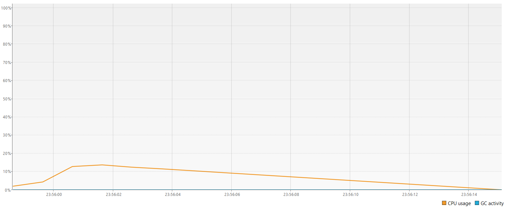
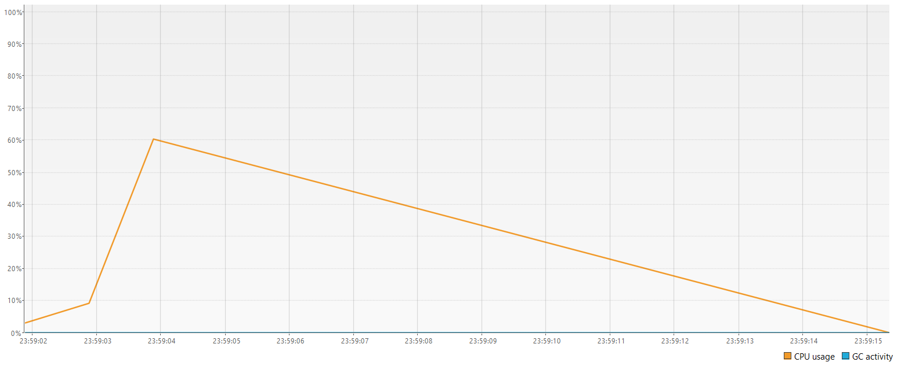

# Projekt 2: Framework Fork-Join
**Przedmiot:** Programowanie współbieżne w języku JAVA

## O projekcie
Celem projektu jest implementacja i analiza wydajnościowa algorytmu rozmycia Gaussa (Gaussian Blur) z wykorzystaniem frameworka **Fork-Join**. Aplikacja pozwala na bezpośrednie porównanie czasu przetwarzania obrazu w sposób sekwencyjny oraz zrównoleglony w ramach jednego pliku.

Projekt demonstruje:
1. **Podział problemu:** Rekurencyjne dzielenie obrazu (poziome cięcie na paski) za pomocą schematu Divide and Conquer.
2. **Zarządzanie wątkami:** Wykorzystanie klasy `ForkJoinPool` oraz zadania dziedziczącego po `RecursiveAction`.
3. **Optymalizację:** Dobór optymalnego progu (threshold) podziału zadania.

## Instrukcja uruchomienia i testowania
Główną klasą aplikacji jest `GaussianBlur.java`. Została ona wyposażona w przełącznik trybu działania, co ułatwia testy wydajnościowe.

Aby przetestować aplikację:
1. Upewnij się, że w folderze `assets/` znajduje się duże zdjęcie testowe (np. `test_image.jpg` w rozdzielczości 4K dla najlepszych wyników pomiarowych).
2. Wewnątrz metody `main` w pliku `GaussianBlur.java` znajdź zmienną `MODE`:
   - `int MODE = 0;` – Uruchamia klasyczne, sekwencyjne przetwarzanie obrazu (jeden wątek).
   - `int MODE = 1;` – Uruchamia współbieżne przetwarzanie wykorzystujące pulę `ForkJoinPool`.
3. Po uruchomieniu program wypisze w konsoli czas wykonania w milisekundach i wygeneruje nałożony filtr w pliku `output.jpg`.

## Analiza techniczna

### Porównanie trybów pracy

W trybie sekwencyjnym algorytm obciąża tylko jeden rdzeń, co skutkuje długim czasem oczekiwania na rezultat, natomiast tryb Fork-Join równolegle rozkłada obliczenia na wszystkie dostępne rdzenie przyspieszając tym samym czterokrotnie czas operacji. Porównując obie wersje przetworzonych obrazów, można zauważyć dużo lepszą jakość przy trybie Fork-Join.

### Mechanizm work-stealing

Podczas analizy przebiegów użycia wątków, można zauważyć, że kończą czas w niemal identycznym momencie. Jest to skutek działania mechanizmu work-stealing, który powoduje, że wątek po skończeniu swojej kolejki zadań zamiast przejść w stan bezczynności, przejmuje najstarsze zadanie z dołu kolejki z innego obciążonego wątku, przyspieszając tym samym czas operacji.

### Badanie wpływu wartości threshold

Wartość threshold określa w programie próg podziału zadania, czyli ile maksymalnie wierszy przetworzy pojedynczy wątek, dla wartości 1000 program wykonywał operacje przez około 650 ms, a dla wartości 100 i 10 czas wykonywania wynosił od 480 do 520 ms. Opóźnienie czasu wykonywania operacji dla wartości 1000 wynika z niedostatecznego podziału zadań. Przy wartościach 10 i 100 brak różnicy czasowej wskazuje na osiągnięcie całkowitego podziału zadań między rdzenie, a zmniejszenie wartości thresholdu poniżej 100 skutkuje zmniejszenie zapasu pamięci RAM, co może się przyczynić do awarii systemu.

### Profilowanie wydajności

Przebiegi zużycia procesora dla obu trybów:

| Tryb sekwencyjny         | Tryb Fork-Join           |
| ----------------------   | ----------------------   |
|    | |

W trybie sekwencyjnym obciążenie CPU utrzymuje się na poziomie kilkunastu procent, co wynika z użycia pojedynczego rdzenia. Natomiast w trybie Fork-Join widoczne jest znacznie wyższe obciążenie procesora, sięgające nawet 60%. Jest to efekt równoległego przetwarzania zadań na wielu rdzeniach, co przekłada się na skrócenie czasu wykonania programu.

### Work-stealing

Analiza wykresów z profilera ujawniła kluczową cechę frameworka Fork-Join: poszczególne wątki robotnicze kończą swoje cykle życia niemal w dokładnie tym samym momencie. Jest to bezpośredni dowód na poprawne działanie algorytmu work-stealing - gdy dany wątek opróżni swoją kolejkę, nie przechodzi w stan uśpienia (co marnowałoby czas procesora). Zamiast tego dynamicznie "kradnie" zadania z przeciwnego końca kolejki innego, wciąż obciążonego wątku.Profiler pokazuje równomierne rozłożenie obciążenia i jednoczesne wygaszanie wątków.

### Wnioski końcowe

Implementacja algorytmu rozmycia Gaussa z wykorzystaniem frameworka Fork-Join wykazała znaczące skrócenie czasu przetwarzania obrazu w porównaniu do metody sekwencyjnej, przy zachowaniu pełnej poprawności i identycznej jakości wyniku końcowego. Ten wzrost wydajności wynika z efektywnego rozłożenia obliczeń na wiele rdzeni procesora, co potwierdzają odczyty profilera wykazujące równomierne obciążenie wszystkich wątków dzięki mechanizmowi work-stealing. Kluczowym czynnikiem optymalizacyjnym okazał się dobór parametru threshold, którego właściwa wartość pozwala uniknąć zarówno niedostatecznego wykorzystania zasobów przy zbyt dużych porcjach danych, jak i nadmiernego obciążenia pamięci operacyjnej oraz procesora przy zbyt drobnej dekompozycji problemu.

## Lista zadań (TODO)

### Faza 1: Architektura i bazowa logika
- [x] Przygotowanie struktury projektu (utworzenie folderu `assets`, plik `.gitignore`).
- [x] Implementacja sekwencyjnego algorytmu splotu (convolution) dla rozmycia Gaussa.
- [x] Obsługa wczytywania i zapisywania plików graficznych (ImageIO).
- [ ] Stworzenie prostego GUI do podglądu obrazu przed i po operacji (Opcjonalnie).

### Faza 2: Implementacja Fork-Join
- [x] Implementacja klasy `BlurTask` dziedziczącej po `RecursiveAction`.
- [x] Zaimplementowanie logiki podziału problemu na mniejsze pod-zadania (cięcie na wiersze).
- [x] Integracja z `ForkJoinPool` i wykorzystanie metody `invokeAll`.
- [x] Wdrożenie parametru określającego próg podziału (`THRESHOLD`).

### Faza 3: Profilowanie i Analiza
- [x] Uruchomienie aplikacji z podpiętym profilerem (np. VisualVM, JProfiler).
- [x] Wykonanie pomiarów czasu wykonania dla obu trybów (`MODE=0` vs `MODE=1`) na dużym obrazie (np. 4K).
- [x] Przeprowadzenie eksperymentów polegających na zmianie wartości `THRESHOLD` (np. 10, 100, 1000) i odnotowanie wpływu na czas wykonania.
- [x] Zrzuty ekranu z profilera (zużycie procesora w czasie dla obu trybów).

### Faza 4: Dokumentacja
- [x] Sformułowanie ostatecznych wniosków z analizy porównawczej.
- [x] Opisanie zjawiska "work-stealing" występującego we frameworku Fork-Join na podstawie obserwacji profilera.
- [ ] Złożenie końcowego0 sprawozdania lub przygotowanie prezentacji.

## Autorzy0
- Mateusz Moskwin
- Beniamin Raczyński
- Monika Szczerba
- Kacper Marciniak
- Maciej Wojnowski
